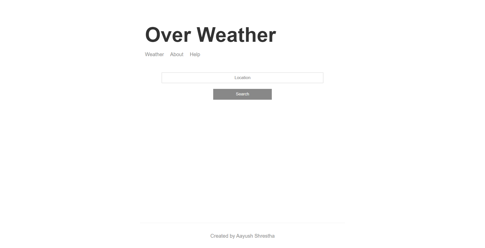
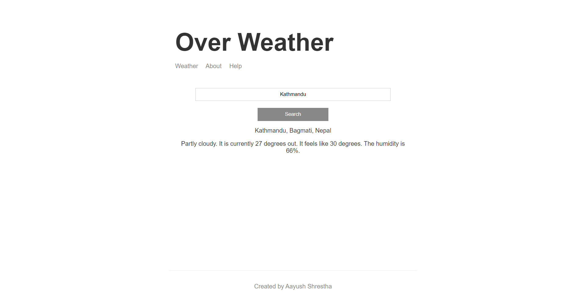

# Weather App

This is the GUI version of a weather app created using **Node.js**. This app simply lets a user to input the user's location which is used to extract the longitude and latitude through a **geo-code API**, then displays the current weather of the entered location by fetching out from a **weather API**.

## API
- [Mapbox](https://www.mapbox.com/)

    This API is used to geo-code the user's entered location, which is then used by the WeatherStack API.

- [WeatherStack](https://weatherstack.com/)

    This API is used to retrieve the current weather conditions for the user-specified location.

## Heroku Deployment
- [Over Weather](https://over-weather.herokuapp.com/)

## Screenshot

## Prerequisite
- [Node.js](https://nodejs.org/en/download/) 
- Text Editor (E.g.: [Visual Studio Code](https://code.visualstudio.com/download))

## Running the project
- Clone the repository.
    
    ``git clone https://github.com/ayxsth/weather-app-node.git``
- Open in Visual Studio Code *(optional)*
- Run the Terminal from inside the folder.
- Install the required libraries.

    ``npm i``
- Execute the application.

    ``npm run dev``